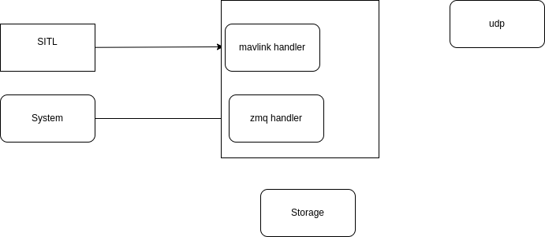

# STAR 2 GPS
Read gps data and publish them via udp , for testing the gps data came from Ardupilot SITL, in production it read from floki
The data serial as 3 doubles as little endian 
- lat
- lon
- alt




---

## usage
We control the application using arguments

| arg  | desc  | note  |
|---|---|---|
| gps  | Control the gps source, if the the tag exists read gps data from SITL otherwise get data from production system | false in production  |
| log  | Store gps data to file  | false in prodution  |
| address  | udp destination  | default 127.0.0.1  |
| port  | udp dest port   | default 5005  |


---

## SITL

```
./arducopter --model copter --speedup 1 --slave 0 --defaults default.param --sim-address 127.0.0.1
```