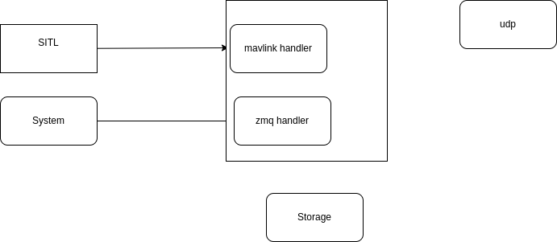

# STAR 2 GPS
Read gps data and publish them via udp , for testing the gps data came from Ardupilot SITL, in production it read from floki
The data serial as 3 doubles as little endian 
- lat
- lon
- alt




---

## usage
We control the application using arguments

| arg  | desc  | note  |
|---|---|---|
| gps  | Control the gps source, if the the tag exists read gps data from SITL otherwise get data from production system | false in production  |
| log  | Store gps data to file  | false in prodution  |
| address  | udp destination  | default 127.0.0.1  |
| port  | udp dest port   | default 5005  |


---

## SITL

```
./arducopter --model copter --speedup 1 --slave 0 --defaults default.param --sim-address 127.0.0.1
```

## NMEA Messages Types
NMEA (National Marine Electronics Association) messages are standardized strings used in GPS and GNSS systems to transmit data like position, time, and satellite information. Below are explanations of the requested messages. Note that messages starting with $PSTM are proprietary (likely from Trimble or similar manufacturers), while $GP and $GN are standard.

1. $PSTMPPSDATA: A proprietary message providing Pulse Per Second (PPS) data, including timing information such as PPS status, offset, and accuracy. Used for precise time synchronization in GPS receivers.

2. $PSTMPV: A proprietary message containing position and velocity data, including latitude, longitude, altitude, speed over ground, and course. It provides real-time navigation information.

3. $PSTMPVRAW: A proprietary raw version of position and velocity data, often including unfiltered or minimally processed measurements like pseudoranges or Doppler shifts from satellites.

4. $PSTMUTC: A proprietary message delivering Coordinated Universal Time (UTC) data, such as time of day, date, and leap second information, synchronized with GPS time.

5. $PSTMCPU: A proprietary message related to the receiver's CPU or processor status, potentially including load, temperature, or diagnostic information for internal monitoring.

6. $GPGGA: A standard NMEA sentence for Global Positioning System Fix Data. It includes time, latitude, longitude, altitude, fix quality, number of satellites, HDOP (horizontal dilution of precision), and geoid separation. Commonly used for basic GPS position reporting.

7. $GNGSA: A standard NMEA sentence for GNSS DOP and Active Satellites. It provides dilution of precision (DOP) values (PDOP, HDOP, VDOP) and lists the IDs of active satellites for each GNSS constellation (e.g., GPS, GLONASS). Used to assess fix accuracy.